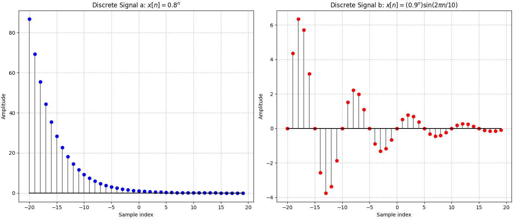
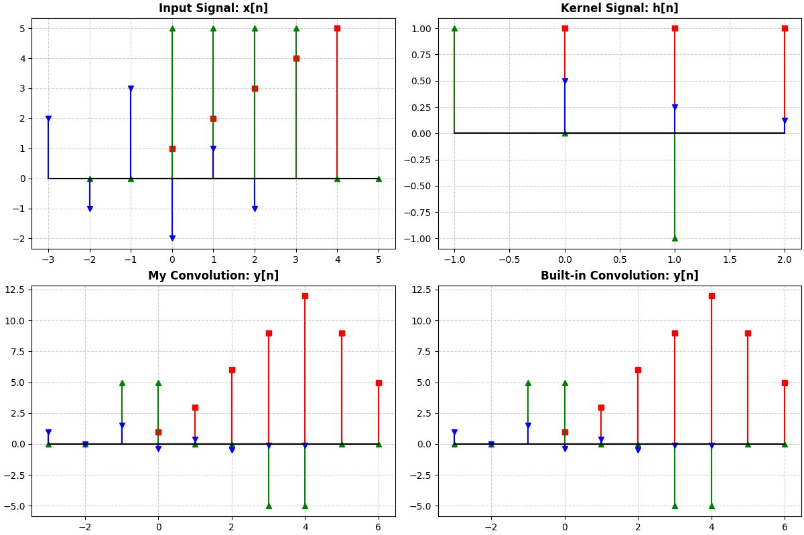

# Ayrık Zamanlı Sinyaller ve 1B Konvolüsyon (1D Discrete Convolution)

Bu proje, ayrık zamanlı (discrete-time) sinyallerin matematiksel olarak modellenmesi ve iki sinyal arasındaki konvolüsyon işleminin teorik temellere (Katla-Kaydır-Çarp-Topla) dayanarak sıfırdan Python ile geliştirilmesini içermektedir.

## 📌 Proje Hakkında

Sinyal ve görüntü işlemenin temel taşlarından biri olan konvolüsyon işlemi, bu projede dilin hazır kütüphanelerine (örn. `numpy.convolve`) bağımlı kalmadan, temel matematiksel formülü kullanılarak implemente edilmiştir:

$$y[n] = \sum_{k=-\infty}^{\infty} x[k] h[n-k]$$

Proje kapsamında geliştirilen `my_conv` algoritması, sadece nedensel (causal) sinyalleri değil, aynı zamanda zaman ekseninde negatif indekslere sahip (geçmiş zamanlı) sinyalleri ve filtreleri de doğru bir şekilde kaydırarak zaman ekseni ($n$) sınırlarını dinamik olarak hesaplar.

## 🚀 Özellikler

* **Matematiksel Sinyal Üretimi:** Üstel büyüme/sönümlenme ($0.8^n$) ve sinüsoidal dalgaların ayrık zamanlı modellenmesi.
* **Özel Konvolüsyon Algoritması:** Matris çarpımı yerine teorik kaydırma ve indeks eşleştirme mantığıyla yazılmış `my_conv` fonksiyonu.
* **Negatif İndeks Desteği:** Orijin ($n=0$) merkezli türev/kenar filtrelerinin giriş sinyallerine uygulanabilmesi.
* **Görselleştirme:** Matplotlib kullanılarak, farklı senaryoların aynı anda kıyaslanabildiği detaylı `stem` grafikleri.

## 📊 Çıktılar ve Görseller

### 1. Ayrık Zamanlı Sinyallerin Modellenmesi
Pozitif/negatif zaman eksenlerinde sönümlenen ve artan üstel fonksiyonlar ile periyodik sinüs dalgalarının genlik değişimleri.



### 2. Konvolüsyon İşlemi (Custom vs. Built-in)
Üç farklı sinyal ve filtre (kernel) senaryosu test edilmiştir:
1.  **Senaryo 1 (Kırmızı):** Standart nedensel sinyaller ve hareketli ortalama (smoothing) filtresi.
2.  **Senaryo 2 (Yeşil):** Negatif indeksler içeren giriş sinyali ve orijin merkezli fark (türev/edge) filtresi.
3.  **Senaryo 3 (Mavi):** Karmaşık indekslere sahip, sönümleyici (decay) filtre uygulaması.

Aşağıdaki grafikte, kendi geliştirdiğimiz `my_conv` fonksiyonu ile NumPy'ın `np.convolve` fonksiyonunun çıktılarının birebir örtüştüğü görülmektedir:



## 🛠️ Kurulum ve Kullanım

Projeyi çalıştırmak için sisteminizde Python 3.x ve aşağıdaki kütüphanelerin yüklü olması gerekmektedir:

```bash
pip install numpy matplotlib
```

Kodu doğrudan çalıştırarak PDF ve PNG çıktılarını elde edebilirsiniz:

```bash
python convolution_script.py
```

## 👨‍💻 Geliştirici

**Ömer Bircan Şahin** Yıldız Teknik Üniversitesi (YTÜ) - Bilgisayar Mühendisliği Yüksek Lisans
